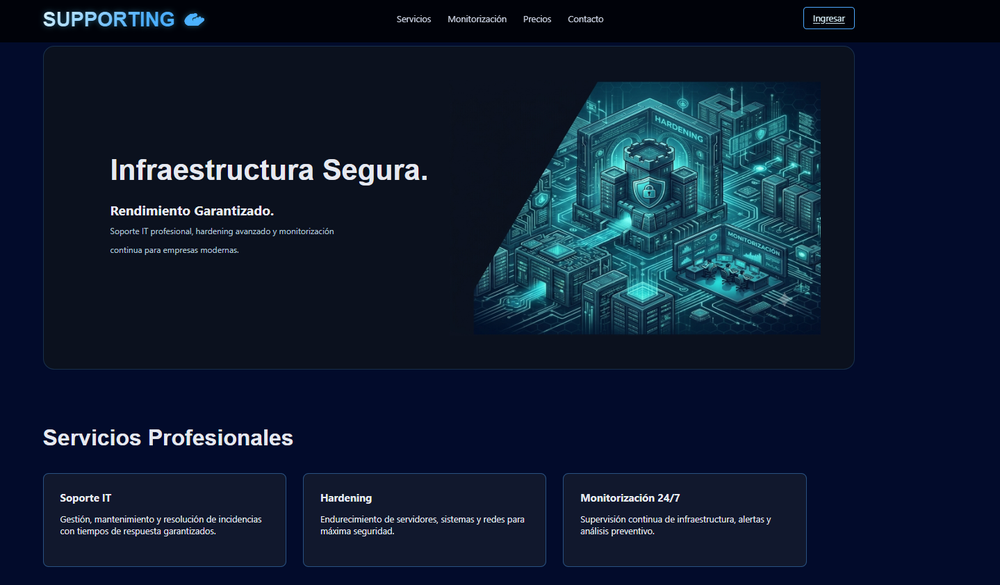
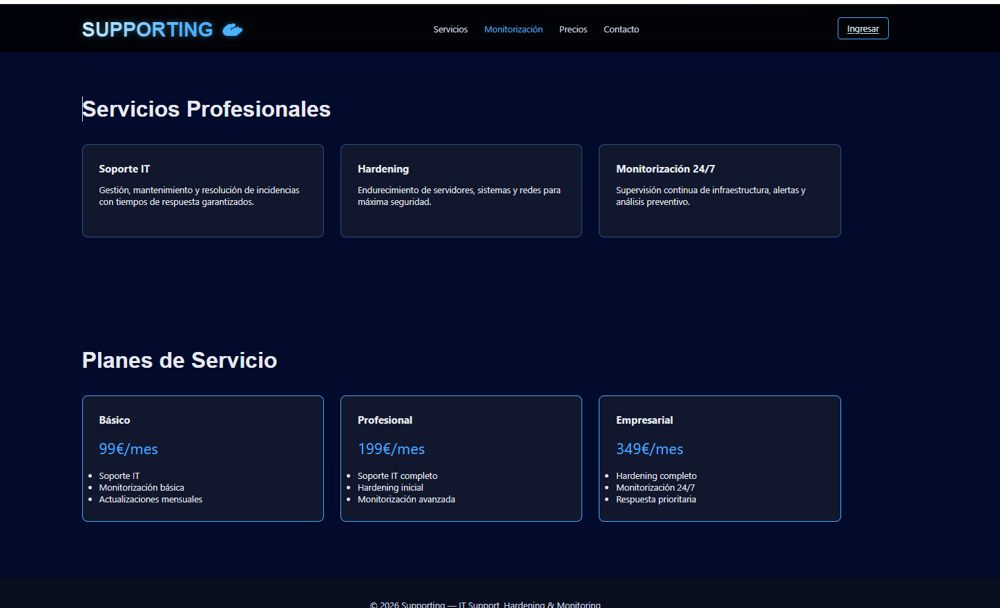
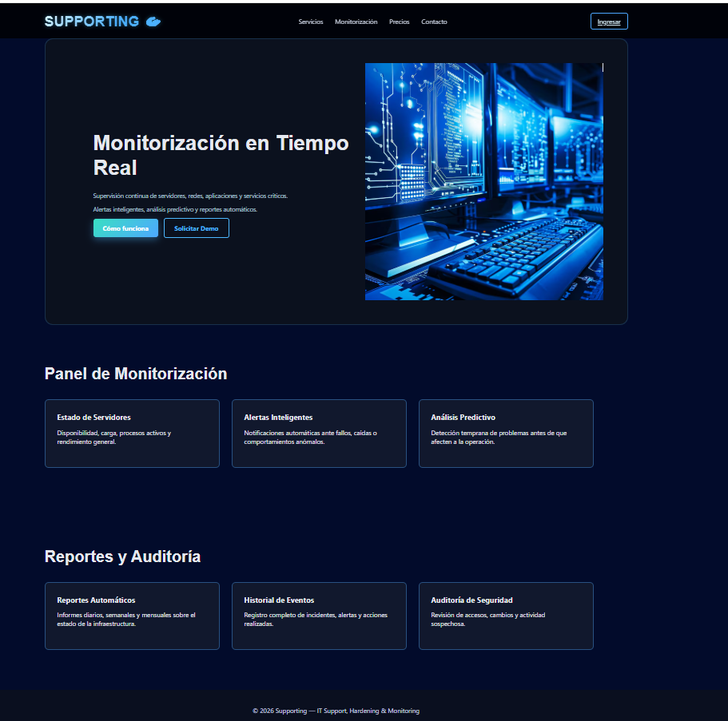
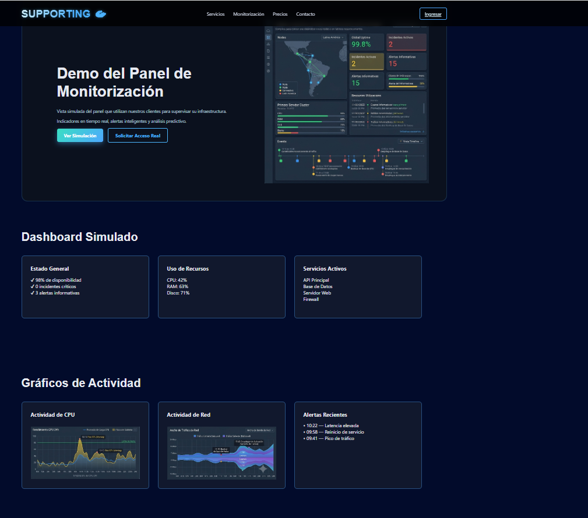
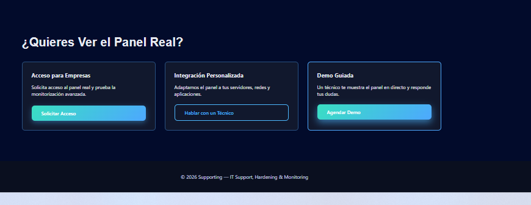
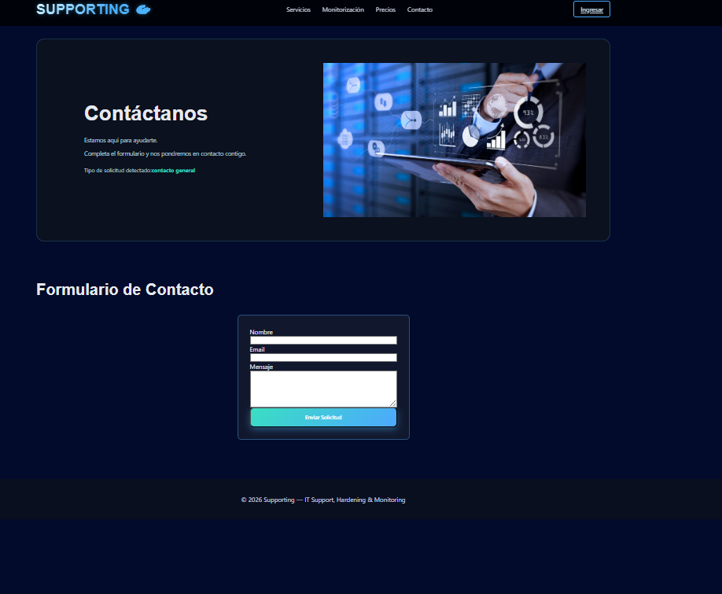
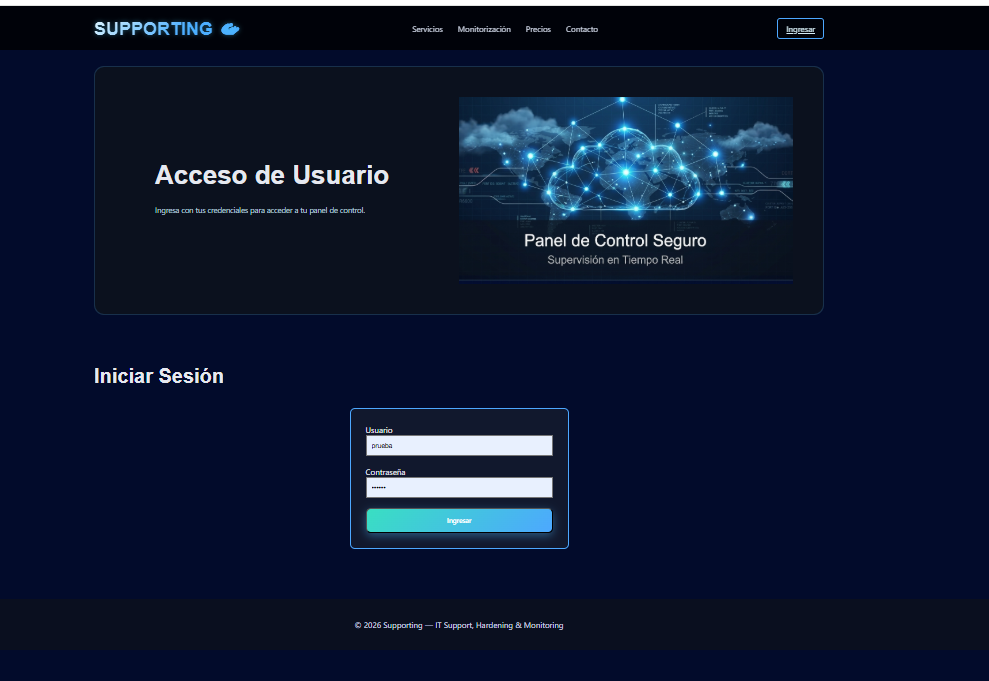
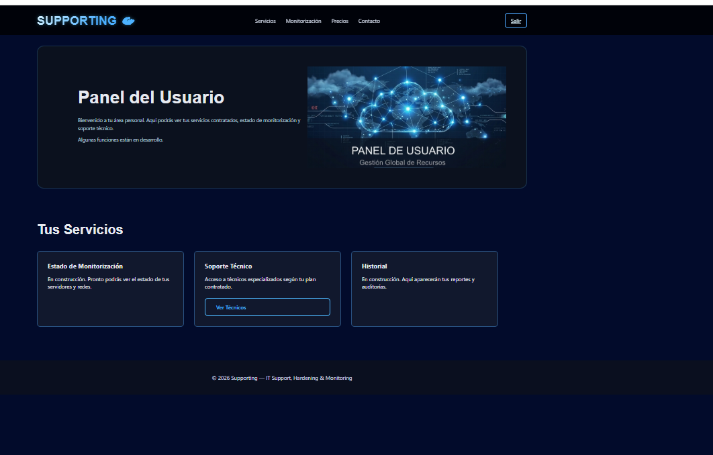
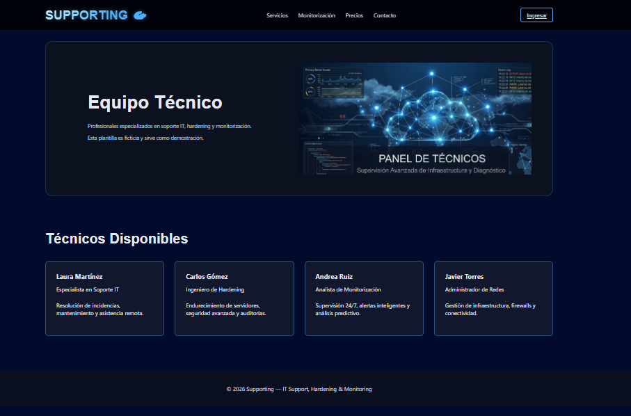

# SUPPORTING — Plataforma de Soporte IT, Hardening y Monitorización
**Versión 1.0.0**
En producción.
## Descripción General
Supporting es una plataforma web diseñada para ofrecer servicios profesionales de soporte IT, hardening de infraestructura y monitorización continua. El proyecto está estructurado como una solución escalable que integra un backend modular desarrollado con FastAPI y un frontend corporativo construido con React. La plataforma está preparada para evolucionar hacia un panel empresarial completo, un panel técnico con agenda de disponibilidad y un sistema de monitorización en tiempo real.

El objetivo es proporcionar una base sólida que permita gestionar usuarios, técnicos, tickets, servicios y empresas, además de ofrecer una experiencia profesional tanto para clientes como para administradores y técnicos.

---

## Arquitectura del Proyecto

El sistema Supporting está dividido en dos componentes principales:

### Backend (FastAPI + PostgreSQL)
API REST modular que gestiona:

- Autenticación con JWT  
- Gestión de usuarios  
- Tickets  
- Técnicos  
- Servicios  
- Contacto  
- Acceso empresarial  
- Integración personalizada  
- Demo guiada  
- Monitorización (integración futura)

El backend está diseñado para ser escalable, seguro y fácil de integrar con sistemas externos.

### Frontend (React + Vite)
Aplicación web corporativa y panel de usuario que incluye:

- Página principal y servicios  
- Monitorización (simulada en esta versión)  
- Precios  
- Contacto  
- Login  
- Panel del usuario  
- Página de técnicos  
- Demo guiada  
- Acceso empresarial  

El frontend consume la API del backend y está preparado para integrar dashboards avanzados y paneles empresariales.

---

## Tecnologías Utilizadas

### Backend
- FastAPI  
- SQLAlchemy  
- PostgreSQL  
- Pydantic  
- bcrypt  
- JWT  
- Uvicorn  

### Frontend
- React  
- Vite  
- Context API  
- CSS modular  
- Fetch/Axios (según implementación en services)

### Infraestructura (futuro despliegue)
- AWS EC2  
- AWS RDS o PostgreSQL local  
- AWS CloudWatch  
- API Gateway + Lambda (posible migración serverless)

---

## Estructura del Backend


```

backend/
│
├── app/
│   ├── controllers/      Lógica de negocio
│   ├── routes/           Endpoints FastAPI
│   ├── models/           Modelos SQLAlchemy
│   ├── schemas/          Validación con Pydantic
│   ├── utils/            Seguridad, hashing y utilidades
│   ├── database.py       Conexión a PostgreSQL
│   └── main.py           Inicialización de FastAPI
│
├── venv/
└── requirements.txt

```
Estructura del Frontend

```
supporting-frontend/
│
├── public/
├── src/
│   ├── assets/           Recursos estáticos (css, img, js)
│   ├── context/          Gestión de autenticación
│   ├── pages/            Páginas principales
│   ├── router/           Rutas de la aplicación
│   ├── services/         Conexión con la API
│   ├── App.jsx
│   ├── main.jsx
│   └── index.css
│
├── package.json
└── vite.config.js

```


---

## Funcionalidades Actuales

### Backend
- Registro de usuarios  
- Login con JWT  
- Cambio de contraseña  
- Creación de usuarios por administrador  
- Gestión de tickets  
- Gestión de técnicos  
- Gestión de servicios  
- Contacto  
- Acceso empresarial  
- Integración personalizada  
- Demo guiada  

### Frontend
- Página corporativa completa  
- Sección de servicios  
- Sección de monitorización (simulada)  
- Sección de precios  
- Página de contacto  
- Página de técnicos  
- Login  
- Panel del usuario  
- Demo guiada  
- Acceso empresarial  

---

## Escalabilidad y Próximas Mejoras

El proyecto está diseñado para crecer en tres fases:

### Fase 1 — Plataforma corporativa + backend estable  
Completada.

- Futuras mejoras poder agendar cita con equipo tecnico desde la wed 
- Integracion de la app de monitorio

### Fase 2 — Plataforma empresarial
- Panel empresarial completo  
- Panel técnico con agenda de disponibilidad  
- Gestión avanzada de tickets  
- Roles y permisos  
- Integración con servicios externos  

### Fase 3 — Monitorización en tiempo real
- Métricas de infraestructura  
- Alertas inteligentes  
- Logs centralizados  
- Auditoría  


---

## Instalación y Ejecución

### Backend

```
cd backend
python -m venv venv
source venv/bin/activate   # Windows: venv\Scripts\activate
pip install -r requirements.txt
python run.py --reload

```
--- 

Frontend

```
cd supporting-frontend
npm install
npm run dev

```

## Despliegue en AWS (Free Tier)

El proyecto está preparado para desplegarse en AWS utilizando:

- EC2 para el backend  
- RDS o PostgreSQL local  
- Nginx como reverse proxy  
- CloudWatch para monitoreo  
- S3 para recursos estáticos (opcional)  
- API Gateway + Lambda (opcional)

---

## Roadmap de Desarrollo

### Documentación, limpieza de código, preparación del despliegue.

### Desarrollo del panel empresarial y panel técnico.

### Integración completa con backend, roles y permisos.

### Monitorización, métricas, logs y despliegue final en AWS.

---

## Estado Actual del Proyecto

- Backend estable y funcional  
- Frontend corporativo completo  
- Panel del usuario operativo  
- Integración con API funcionando  
- Preparado para plataforma empresarial  
- Preparado para monitorización real  
- Preparado para despliegue en AWS  

---

## Licencia

Proyecto privado. Todos los derechos reservados.

---

## Autora

Desarrollado por Briyit.

---

## Vista General del Proyecto

### Página Principal


### Servicios


### Plan de Monitorización


### Monitorización


### Opciones de Contacto


### Página de Contacto


### Login


### Panel del Usuario


### Página de Técnicos

