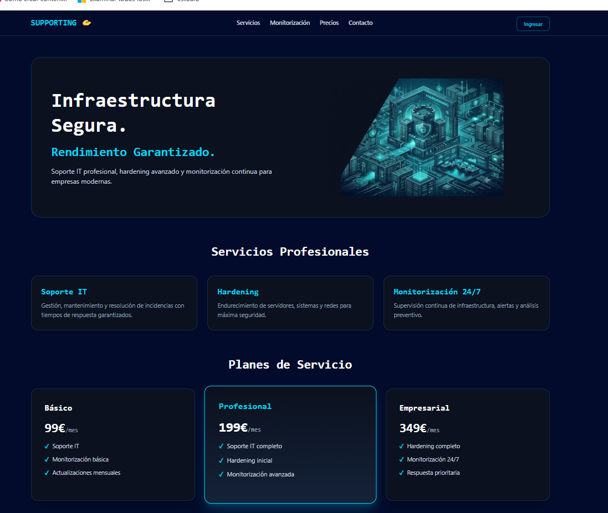
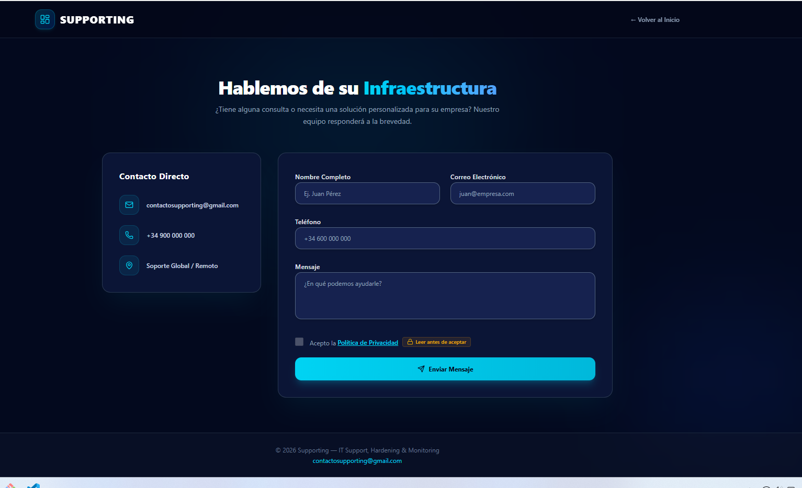
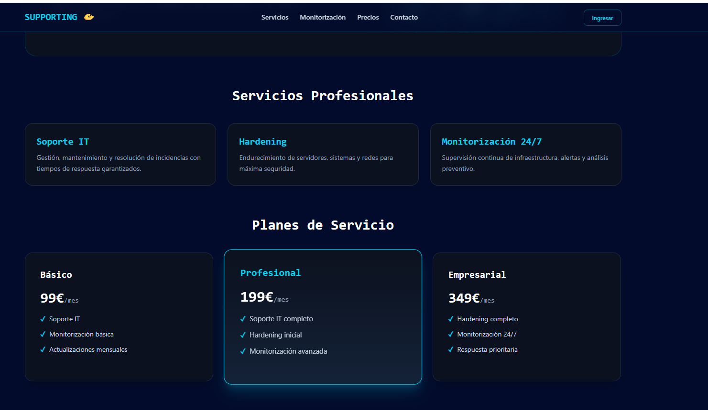
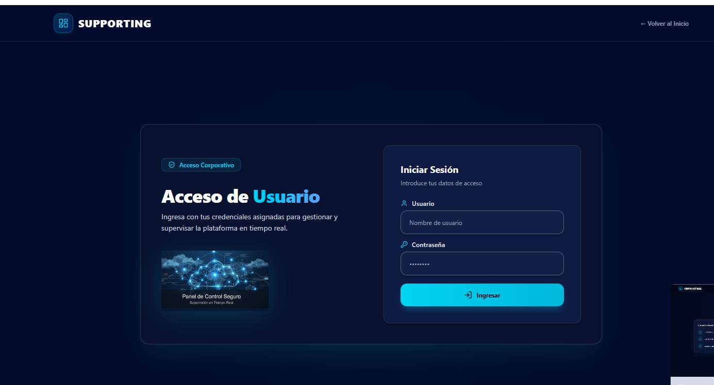

<div align="center">

#  SUPPORTING V1 - CRM & Web Corporate
## WED - supportin
<p align="center">
  <b>Modern client-server architecture powered by React, Tailwind CSS, and FastAPI</b>
</p>

<p align="center">
  
  
  
  
  
</p>

</div>

---

##  Visión General

**SUPPORTING V1** es una solución robusta diseñada para la gestión integral de servicios, técnicos e incidencias (CRM), combinada con una presencia web corporativa moderna. El sistema se comunica a través de una API RESTful de alto rendimiento conectada a una base de datos relacional.

```text
Usuario 
   │
   ▼
[ React + Tailwind CSS ] (Frontend Client)
   │
   ▼ (REST API / Endpoints)
[ FastAPI ] (Backend Server)
   │
   ▼
[ SQLAlchemy ORM ]
   │
   ▼
[ PostgreSQL ] (Database)
```

---

## 📂 Estructura del Proyecto

El repositorio está organizado en dos componentes principales (`backend` y `supporting-frontend`):

```text
supporting/
├── backend/
│   ├── app/
│   │   ├── controllers/
│   │   ├── logs/
│   │   ├── models/
│   │   ├── routes/
│   │   ├── schemas/
│   │   ├── utils/
│   │   ├── config.py
│   │   ├── database.py
│   │   ├── main.py
│   │   └── security.py
│   ├── docs/
│   │   └── v1/
│   │       ├── img/
│   │       └── arquitectura.md
│   ├── requirements.txt
│   ├── run.py
│   └── README.md
└── supporting-frontend/
    ├── public/
    ├── src/
    │   ├── assets/
    │   ├── components/
    │   ├── context/
    │   ├── pages/
    │   ├── router/
    │   ├── services/
    │   ├── App.css
    │   ├── App.jsx
    │   ├── index.css
    │   └── main.jsx
    └── package.json
```

---

##  Arquitectura & Responsabilidades

###  Frontend (`supporting-frontend`)
Desarrollado con **React** y estilizado de forma moderna con **Tailwind CSS**.
* **Web corporativa:** Presentación institucional y de soluciones IT.
* **Portal de servicios:** Consulta interactiva de soluciones ofrecidas.
* **Área de usuario & Login:** Gestión de sesiones seguras mediante tokens.
* **Gestión de peticiones:** Formularios de contacto y atención al cliente.

### 🔌 Backend (`backend`)
Desarrollado con **FastAPI** y estructurado mediante capas limpias.
* **Autenticación JWT:** Seguridad robusta para control de sesiones y roles.
* **Gestión de usuarios y técnicos:** Alta, modificación de perfiles y asignación de especialidades.
* **Gestión de servicios y tickets:** Creación, seguimiento de incidencias y flujos operativos.
* **Formularios de contacto:** Procesamiento de solicitudes comerciales y empresariales.

---

##  Módulos del Sistema

| Módulo | Descripción / Características |
| :--- | :--- |
| **Autenticación** | Registro, inicio de sesión seguro con JWT y cambio de contraseña. |
| **Gestión de Usuarios** | Alta de usuarios, modificación de datos y control de roles. |
| **Servicios** | Consulta de servicios y presentación comercial de soluciones IT. |
| **Técnicos** | Visualización del personal técnico y desglose de especialidades. |
| **Tickets** | Creación de incidencias y seguimiento operativo básico. |
| **Contacto** | Solicitud comercial, de información y acceso empresarial. |

---

##  Guía de Inicio Rápido

### 1. Configurar el Backend

```bash
# Entrar a la carpeta del backend
cd backend

# Crear y activar entorno virtual
python -m venv venv
# En Windows:
venv\Scripts\activate
# En Linux/macOS:
# source venv/bin/activate

# Instalar dependencias
pip install -r requirements.txt

# Configurar variables de entorno (.env) y ejecutar
python run.py
```

### 2. Configurar el Frontend

```bash
# Entrar a la carpeta del frontend
cd supporting-frontend

# Instalar dependencias (incluyendo Tailwind CSS)
npm install

# Iniciar servidor de desarrollo
npm run dev
```

---


<p align="center">
  Desarrollado para SUPPORTING V1.
</p>

## En produción 

Pasos pendientes:
* Actualización futura cuando este la plataforma lista , unificando endpoints.
* Autenticación en dos fases.

# Vistas Previas del Sistema

* Página de Inicio
  
  
* Formulario de Contacto
  

* Precios y Servicios
  

* Registro / Autenticación (Log)
  